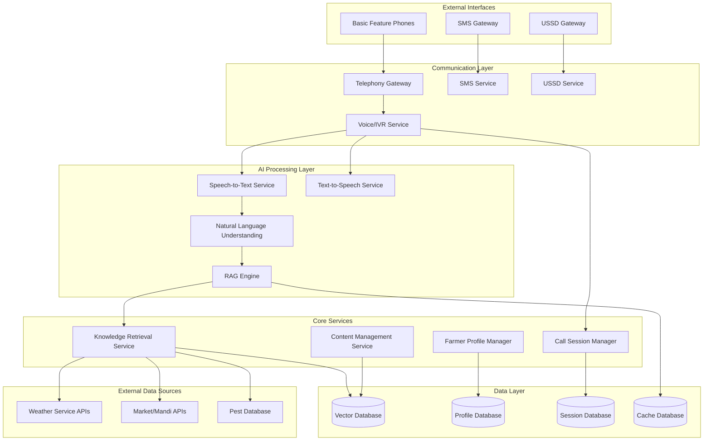

# Design Document: Vani-Agri AI Gateway

## Overview

The Vani-Agri AI Gateway is a comprehensive AI-powered agricultural intelligence platform designed to serve rural farmers through voice interfaces accessible via basic feature phones. The system leverages a microservices architecture to provide real-time agricultural guidance, weather information, pest management advice, and market prices through multiple communication channels (Voice/IVR, SMS, USSD) without requiring internet connectivity on the user's device.

The platform combines advanced AI technologies including Retrieval-Augmented Generation (RAG), multilingual speech processing, and semantic search to deliver contextually relevant agricultural advice. The system is designed for high availability, scalability, and resilience to serve thousands of concurrent users across rural India.

## Architecture

The Vani-Agri AI Gateway follows a distributed microservices architecture with the following key architectural principles:

### High-Level Architecture



### Architectural Patterns

1. **Microservices Architecture**: Each major functionality is implemented as an independent service
2. **Event-Driven Communication**: Services communicate through message queues for loose coupling
3. **Circuit Breaker Pattern**: Resilience against external service failures
4. **Caching Strategy**: Multi-level caching for performance optimization
5. **Load Balancing**: Horizontal scaling for high availability
6. **API Gateway Pattern**: Centralized routing and cross-cutting concerns

## Components and Interfaces

### 1. Telephony Gateway Service

**Purpose**: Manages telephony integration and call routing across multiple carriers.

**Key Responsibilities**:
- Multi-carrier telephony integration (Twilio, Exotel, Knowlarity)
- Call routing and load balancing
- Audio quality monitoring and optimization
- Cost optimization through intelligent routing

**Interfaces**:
```typescript
interface TelephonyGateway {
  initiateCall(phoneNumber: string, callbackUrl: string): CallSession
  handleIncomingCall(callData: IncomingCallData): CallSession
  routeCall(callId: string, destination: string): boolean
  monitorCallQuality(callId: string): QualityMetrics
  terminateCall(callId: string): void
}

interface CallSession {
  callId: string
  phoneNumber: string
  startTime: Date
  status: CallStatus
  qualityMetrics: QualityMetrics
}
```

### 2. Voice/IVR Service

**Purpose**: Handles voice interactions, call flow management, and audio processing.

**Key Responsibilities**:
- Call flow orchestration
- Audio streaming and processing
- Language detection and routing
- Session state management
- Integration with STT/TTS services

**Interfaces**:
```typescript
interface VoiceIVRService {
  handleCallStart(callSession: CallSession): void
  processAudioStream(audioData: AudioStream): void
  playPrompt(callId: string, promptText: string, language: Language): void
  collectSpeechInput(callId: string, timeout: number): Promise<string>
  transferToHuman(callId: string): void
  endCall(callId: string): void
}

interface AudioStream {
  callId: string
  audioData: Buffer
  timestamp: Date
  sampleRate: number
}
```

### 3. Speech-to-Text (STT) Service

**Purpose**: Converts farmer speech to text with support for Indian regional languages.

**Key Responsibilities**:
- Multi-language speech recognition (Hindi, Tamil, Telugu, Kannada, Bengali, Gujarati)
- Dialect and accent adaptation
- Real-time streaming transcription
- Confidence scoring and error handling

**Interfaces**:
```typescript
interface STTService {
  transcribeAudio(audioData: Buffer, language: Language): Promise<TranscriptionResult>
  startStreamingTranscription(callId: string, language: Language): TranscriptionStream
  detectLanguage(audioData: Buffer): Promise<Language>
  adaptToSpeaker(speakerId: string, audioSamples: Buffer[]): void
}

interface TranscriptionResult {
  text: string
  confidence: number
  language: Language
  alternatives: string[]
  processingTime: number
}
```

### 4. Text-to-Speech (TTS) Service

**Purpose**: Synthesizes natural-sounding speech responses in regional languages.

**Key Responsibilities**:
- Multi-language speech synthesis
- Voice customization and regional accents
- SSML support for natural speech patterns
- Audio format optimization for telephony

**Interfaces**:
```typescript
interface TTSService {
  synthesizeSpeech(text: string, language: Language, voice?: VoiceProfile): Promise<AudioBuffer>
  generateSSML(text: string, language: Language): string
  optimizeForTelephony(audioData: AudioBuffer): AudioBuffer
  cacheCommonPhrases(phrases: string[], language: Language): void
}

interface VoiceProfile {
  voiceId: string
  gender: 'male' | 'female'
  accent: string
  speed: number
  pitch: number
}
```

### 5. RAG Engine

**Purpose**: Provides contextually relevant agricultural responses using retrieval-augmented generation.

**Key Responsibilities**:
- Query understanding and intent classification
- Knowledge retrieval coordination
- Context integration and response generation
- Multi-modal information synthesis

**Interfaces**:
```typescript
interface RAGEngine {
  processQuery(query: string, farmerProfile: FarmerProfile, context: QueryContext): Promise<AgriResponse>
  retrieveKnowledge(query: string, filters: SearchFilters): Promise<KnowledgeChunk[]>
  generateResponse(query: string, retrievedKnowledge: KnowledgeChunk[], context: QueryContext): Promise<string>
  updateKnowledgeBase(content: AgriContent): void
}

interface AgriResponse {
  response: string
  confidence: number
  sources: string[]
  followUpQuestions: string[]
  relatedTopics: string[]
}
```

### 6. Knowledge Retrieval Service

**Purpose**: Orchestrates retrieval of agricultural knowledge and real-time data.

**Key Responsibilities**:
- Semantic search across agricultural knowledge base
- Real-time data integration (weather, market, pest)
- Context filtering and relevance scoring
- Caching and performance optimization

**Interfaces**:
```typescript
interface KnowledgeRetrievalService {
  searchKnowledge(query: string, filters: SearchFilters): Promise<KnowledgeChunk[]>
  getWeatherData(location: Location, dateRange?: DateRange): Promise<WeatherData>
  getMarketPrices(commodity: string, location: Location): Promise<MarketPrice[]>
  getPestInformation(symptoms: string[], cropType: string, region: string): Promise<PestInfo[]>
  cacheFrequentQueries(queries: string[]): void
}

interface SearchFilters {
  cropTypes: string[]
  region: string
  season: string
  language: Language
  contentTypes: ContentType[]
}
```

### 7. Farmer Profile Manager

**Purpose**: Manages farmer profiles, preferences, and interaction history.

**Key Responsibilities**:
- Profile creation and management
- Preference tracking and personalization
- Interaction history maintenance
- Privacy and data protection

**Interfaces**:
```typescript
interface FarmerProfileManager {
  createProfile(phoneNumber: string, initialData: ProfileData): Promise<FarmerProfile>
  getProfile(phoneNumber: string): Promise<FarmerProfile>
  updateProfile(phoneNumber: string, updates: Partial<ProfileData>): Promise<void>
  recordInteraction(phoneNumber: string, interaction: InteractionRecord): Promise<void>
  deleteProfile(phoneNumber: string): Promise<void>
}

interface FarmerProfile {
  phoneNumber: string
  name?: string
  location: Location
  primaryCrops: string[]
  preferredLanguage: Language
  farmSize?: number
  interactionHistory: InteractionRecord[]
  preferences: UserPreferences
}
```

### 8. SMS Service

**Purpose**: Handles SMS-based information delivery and follow-up communications.

**Key Responsibilities**:
- SMS composition and delivery
- Multi-part message handling
- Language-specific formatting
- Delivery status tracking

**Interfaces**:
```typescript
interface SMSService {
  sendSMS(phoneNumber: string, message: string, language: Language): Promise<SMSResult>
  sendMultiPartSMS(phoneNumber: string, longMessage: string, language: Language): Promise<SMSResult[]>
  formatAgriContent(content: AgriResponse, language: Language): string
  trackDelivery(messageId: string): Promise<DeliveryStatus>
}
```

### 9. USSD Service

**Purpose**: Provides menu-driven access to agricultural information via USSD.

**Key Responsibilities**:
- USSD menu generation and navigation
- Session state management
- Quick access to common queries
- Integration with core agricultural services

**Interfaces**:
```typescript
interface USSDService {
  handleUSSDRequest(phoneNumber: string, input: string, sessionId: string): Promise<USSDResponse>
  generateMenu(menuType: MenuType, language: Language): USSDMenu
  processMenuSelection(selection: string, context: USSDContext): Promise<USSDResponse>
  endUSSDSession(sessionId: string): void
}

interface USSDResponse {
  message: string
  continueSession: boolean
  menuOptions?: string[]
}
```

## Data Models

### Core Data Structures

```typescript
// Farmer and Profile Models
interface Location {
  state: string
  district: string
  block?: string
  village?: string
  coordinates?: {
    latitude: number
    longitude: number
  }
}

interface FarmerProfile {
  phoneNumber: string
  name?: string
  location: Location
  primaryCrops: string[]
  preferredLanguage: Language
  farmSize?: number
  soilType?: string
  irrigationType?: string
  interactionHistory: InteractionRecord[]
  preferences: UserPreferences
  createdAt: Date
  updatedAt: Date
}

interface UserPreferences {
  communicationChannel: 'voice' | 'sms' | 'ussd'
  callbackTime?: string
  detailLevel: 'basic' | 'detailed'
  followUpEnabled: boolean
}

// Interaction and Session Models
interface InteractionRecord {
  sessionId: string
  timestamp: Date
  channel: 'voice' | 'sms' | 'ussd'
  query: string
  response: string
  satisfaction?: number
  duration?: number
}

interface CallSession {
  sessionId: string
  callId: string
  phoneNumber: string
  farmerProfile?: FarmerProfile
  startTime: Date
  endTime?: Date
  status: 'active' | 'completed' | 'dropped' | 'transferred'
  interactions: InteractionRecord[]
  context: SessionContext
}

interface SessionContext {
  currentTopic?: string
  previousQueries: string[]
  weatherData?: WeatherData
  marketData?: MarketPrice[]
  detectedCrops?: string[]
}

// Agricultural Data Models
interface WeatherData {
  location: Location
  current: {
    temperature: number
    humidity: number
    rainfall: number
    windSpeed: number
    conditions: string
  }
  forecast: WeatherForecast[]
  alerts: WeatherAlert[]
  timestamp: Date
}

interface WeatherForecast {
  date: Date
  minTemp: number
  maxTemp: number
  rainfall: number
  conditions: string
  advisory?: string
}

interface MarketPrice {
  commodity: string
  variety?: string
  market: string
  price: number
  unit: string
  date: Date
  trend: 'up' | 'down' | 'stable'
}

interface PestInfo {
  pestId: string
  name: string
  scientificName: string
  affectedCrops: string[]
  symptoms: string[]
  images: string[]
  treatments: Treatment[]
  preventiveMeasures: string[]
  seasonality: string[]
}

interface Treatment {
  type: 'chemical' | 'biological' | 'cultural'
  method: string
  products: string[]
  dosage?: string
  timing: string
  precautions: string[]
}

// Knowledge Base Models
interface KnowledgeChunk {
  id: string
  content: string
  title: string
  category: string
  subcategory: string
  crops: string[]
  region: string[]
  language: Language
  source: string
  confidence: number
  embedding: number[]
  metadata: {
    author?: string
    dateCreated: Date
    lastUpdated: Date
    version: string
  }
}

interface AgriContent {
  title: string
  content: string
  category: ContentCategory
  crops: string[]
  regions: string[]
  language: Language
  tags: string[]
  mediaUrls?: string[]
  source: ContentSource
}

// Enums and Types
type Language = 'hindi' | 'tamil' | 'telugu' | 'kannada' | 'bengali' | 'gujarati' | 'english'
type ContentCategory = 'crop_management' | 'pest_control' | 'weather' | 'market' | 'soil_health' | 'irrigation' | 'fertilizer'
type ContentSource = 'expert' | 'research' | 'government' | 'extension' | 'farmer_feedback'
type CallStatus = 'connecting' | 'active' | 'on_hold' | 'completed' | 'failed' | 'dropped'
```

### Database Schema Design

**Vector Database (Agricultural Knowledge)**:
- Stores agricultural content with semantic embeddings
- Supports similarity search for knowledge retrieval
- Partitioned by language and region for performance
- Includes versioning for content updates

**Profile Database (Farmer Data)**:
- Stores farmer profiles and preferences
- Encrypted storage for personal information
- Indexed by phone number for fast lookup
- Includes interaction history and analytics

**Session Database (Call Management)**:
- Stores active and historical call sessions
- Supports session resumption after disconnection
- Includes performance metrics and quality data
- TTL-based cleanup for old sessions

**Cache Database (Performance Optimization)**:
- Redis-based caching for frequent queries
- Weather and market data caching
- TTS audio caching for common phrases
- Session state caching for quick access